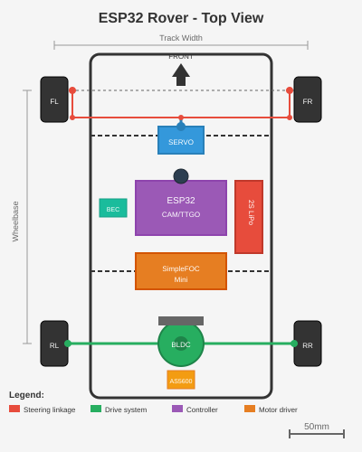

# ESP32 WiFi Rover Firmware

A WiFi-controlled rover platform using ESP32 with camera streaming and web-based control interface.

**Note**: Motor/servo/encoder components have been removed from the codebase as of v1.6. The web control interface (speed, steering, emergency stop) is preserved for future motor implementation. The firmware now focuses on WiFi connectivity, camera streaming, LCD display, and diagnostic features.

<p align="center">
  
</p>

## Features

- **WiFi Control**: AP mode, STA mode, or STA-first with AP fallback
- **Live Video Stream**: MJPEG stream from OV2640 camera (ESP32-CAM only)
- **Virtual Joystick**: Touch-friendly web UI with joystick control (ready for motor integration)
- **LCD Display**: ST7789 135x240 on-device status display (TTGO only)
- **Hardware Buttons**: Left/Right button input with WebUI indicators (TTGO only)
- **Diagnostics Panel**: System info, WiFi status, service status, logs
- **Safety Features**: Command timeout watchdog, task watchdog, emergency stop
- **Deep Sleep Mode**: Hold left button 5 seconds for power-saving sleep (~10µA)
- **OTA Updates**: HTTP-based firmware updates with password protection
- **MQTT Telemetry**: Optional diagnostic data publishing
- **mDNS Discovery**: Access via `esp32-rover.local` or `ttgo-rover.local`
- **Serial Log Capture**: View boot logs in web UI via SSE streaming
- **JTAG Debug Mode**: Build flag to free GPIO 12-15 for hardware debugging
- **Self-Contained**: ESP-IDF v5.2.2 embedded in project

## Supported Hardware

| Target | Board | Camera | LCD | Buttons | Description |
|--------|-------|--------|-----|---------|-------------|
| `esp32cam` | AI-Thinker ESP32-CAM | Yes | No | No | Full features with live video |
| `ttgo` | LilyGO TTGO T-Display | No | Yes | Yes | LCD status display + buttons |

### Optional Hardware

- Motor driver and motors (for future integration - firmware ready)
- 2S LiPo battery (7.4V)
- 5V voltage regulator

## Quick Start

### 1. First-Time Setup (run once)

```bash
# Install ESP-IDF tools (downloads ~1GB of toolchain)
./setup.sh
```

### 2. Configure (optional)

```bash
# Copy secrets template and edit with your WiFi credentials
cp secrets.yaml.example secrets.yaml
nano secrets.yaml

# Regenerate config header
python3 generate_config.py
```

### 3. Build and Flash

```bash
# Build for TTGO T-Display (with LCD + buttons)
./build.sh ttgo

# Build for ESP32-CAM (with camera)
./build.sh esp32cam

# Build and flash
./build.sh ttgo flash

# Build, flash, and open monitor
./build.sh esp32cam flash monitor

# Flash to specific port
./build.sh ttgo flash -p /dev/cu.usbserial-0001
```

### 4. Connect and Control

**AP Mode (default fallback):**
1. Power on the rover
2. Connect to WiFi: **ESP32-Rover** (password: **rover1234**)
3. Open http://192.168.4.1 in a web browser

**STA Mode (connects to your network):**
1. Configure `secrets.yaml` with your WiFi credentials
2. Power on the rover
3. Open http://esp32-rover.local (or http://ttgo-rover.local for TTGO)

## Project Structure

```
esp32-rover-firmware/
├── main/
│   ├── main.c              # Application entry point
│   ├── config.h            # Hardware configuration
│   └── config_generated.h  # Generated from YAML config
├── components/             # Reusable ESP-IDF components
│   ├── camera/             # Camera module (ESP32-CAM only)
│   ├── lcd_display/        # ST7789 LCD driver (TTGO only)
│   ├── web_server/         # HTTP server with control UI
│   ├── mqtt_service/       # MQTT telemetry publisher
│   ├── log_buffer/         # Serial log capture ring buffer
│   └── resource_guard/     # Memory/stack safety guards
├── esp-idf/                # Embedded ESP-IDF v5.2.2
├── docs/
│   ├── software_requirements.md  # Full requirements spec
│   ├── API_REFERENCE.md          # Component API documentation
│   ├── WEBUI_USER_MANUAL.md      # Web UI user guide
│   ├── esp-prog-jtag-guide.md    # JTAG debugging guide
│   └── DEVELOPMENT_LESSONS.md    # Lessons learned
├── test/                   # Unit tests
├── rover_config.yaml       # Main configuration
├── secrets.yaml            # WiFi/MQTT credentials (gitignored)
├── generate_config.py      # Config header generator
├── build.sh                # Build script
├── setup.sh                # First-time setup script
└── sdkconfig.defaults.*    # Target-specific SDK configs
```

## Configuration

### YAML Configuration

The firmware uses `rover_config.yaml` for compile-time configuration:

```yaml
# WiFi mode: ap_only, sta_only, or sta_first
wifi:
  mode: sta_first
  ap:
    ssid: "ESP32-Rover"
  sta:
    connect_timeout: 30

# Optional services
mqtt:
  enabled: true
  broker:
    host: "192.168.1.100"

# Control parameters
control:
  watchdog_timeout_ms: 500
  max_speed_percent: 100

# Task watchdog (auto-reboot on hang)
task_watchdog:
  enabled: true
  timeout_sec: 30
```

After editing, regenerate the header:
```bash
python3 generate_config.py
```

### Secrets

WiFi and MQTT credentials are stored in `secrets.yaml` (not committed to git):

```yaml
wifi_sta_ssid: "YourNetwork"
wifi_sta_password: "YourPassword"
wifi_ap_password: "rover1234"
ota_password: "rover1234"
mqtt_username: ""
mqtt_password: ""
```

## Pin Configuration

### TTGO T-Display

| GPIO | Function | Notes |
|------|----------|-------|
| 18 | LCD SCLK | ST7789 SPI clock |
| 19 | LCD MOSI | ST7789 SPI data |
| 16 | LCD DC | ST7789 data/command |
| 5 | LCD CS | ST7789 chip select |
| 23 | LCD RST | ST7789 reset |
| 4 | LCD BL | Backlight PWM |
| 0 | Button L | Left button (active LOW) |
| 35 | Button R | Right button (active LOW) |

**Available GPIOs for future expansion**: 21-22, 25-27, 32-33 (can be used for motors/sensors)

### ESP32-CAM

| GPIO | Function | Notes |
|------|----------|-------|
| 4 | Flash LED | On-board white LED |
| Many | Camera | See config.h for full camera pinout |

**JTAG Debug Mode**:
| GPIO | Function | Notes |
|------|----------|-------|
| 12 | TDI | JTAG data in |
| 13 | TCK | JTAG clock |
| 14 | TMS | JTAG mode select |
| 15 | TDO | JTAG data out |

**Available GPIOs for future motor expansion**: 12-15 (normal mode), 21-22, 25-27, 32

**Notes**:
- JTAG mode (`JTAG_DEBUG=1`) uses GPIO 12-15
- GPIO 12 is boot-sensitive (must be LOW/floating during boot)

## Web Interface

### Control Interface

The main web UI provides:
- Virtual joystick for speed/steering control (ready for motor integration)
- Battery voltage indicator
- WiFi signal strength display
- Emergency stop button
- Camera stream (ESP32-CAM only)
- Camera on/off toggle (saves resources for OTA)

### Diagnostics Panel

Access system diagnostics by scrolling down:
- **WiFi**: SSID, IP, MAC, channel, signal strength
- **System**: Heap memory, uptime, CPU frequency, task counts per core
- **Services**: REST API, MQTT, Internet connectivity status
- **Time**: NTP-synced local time
- **Logs**: Live serial output with level filtering, download, and clear

## Web API

| Endpoint | Method | Description |
|----------|--------|-------------|
| `/` | GET | Web control interface |
| `/stream` | GET | MJPEG video stream (ESP32-CAM) |
| `/control` | POST | Send control commands |
| `/status` | GET | Get rover status (JSON) |
| `/camera` | GET/POST | Get/set camera stream state |
| `/logs` | GET | Get buffered logs |
| `/logs/stream` | GET | SSE stream of live logs |
| `/logs` | DELETE | Clear log buffer |
| `/ota` | POST | Upload firmware update |

### Control Command Format

```json
{
  "speed": -100 to 100,
  "steering": -100 to 100,
  "estop": true/false
}
```

### Status Response Format

```json
{
  "target": "esp32cam",
  "battery": 7.4,
  "camera": true,
  "rssi": -45,
  "btnL": false,
  "btnR": true,
  "diag": {
    "ssid": "MyNetwork",
    "ip": "192.168.1.50",
    "mac": "AA:BB:CC:DD:EE:FF",
    "freeHeap": 150000,
    "uptime": 3600,
    "tasksCore0": 8,
    "tasksCore1": 4,
    "localTime": "14:30:45",
    "ntpSynced": true,
    "internet": true,
    "restApi": true,
    "mqttEnabled": true,
    "mqttConnected": false
  }
}
```

## OTA Firmware Updates

Update firmware over WiFi:

```bash
# Build new firmware
./build.sh esp32cam

# Upload via curl
curl -X POST -H "X-OTA-Password: rover1234" \
     --data-binary @build/esp32-rover.bin \
     http://esp32-rover.local/ota
```

**Tip**: Disable camera stream before OTA to free resources (use CAM ON/OFF button).

## JTAG Debugging

For hardware debugging on ESP32-CAM, build with JTAG mode to free GPIO 12-15:

```bash
# Build with JTAG enabled
JTAG_DEBUG=1 ROVER_TARGET=esp32cam idf.py build

# Flash and connect debugger
idf.py -p /dev/cu.usbserial-110 flash
openocd -f interface/ftdi/esp32_devkitj_v1.cfg -f target/esp32.cfg

# Connect GDB
xtensa-esp32-elf-gdb -ex "target remote :3333" build/esp32-rover.elf
```

See [ESP-PROG JTAG Guide](docs/esp-prog-jtag-guide.md) for detailed wiring instructions.

## Architecture

```
Core 0: WiFi, Web server, Camera capture, LCD updates, Status updates, MQTT
Core 1: Available for future motor control implementation
```

### Task Allocation

| Task | Core | Priority | Frequency |
|------|------|----------|-----------|
| Status update | 0 | 2 | 20 Hz |
| LCD update | 0 | 1 | ~60 Hz |
| Web server | 0 | - | Event-driven |
| MQTT publish | 0 | 2 | Configurable |

### Task Watchdog

Critical tasks are monitored by ESP-IDF's Task Watchdog Timer (TWDT):
- Status task feeds watchdog every 50ms
- 30-second timeout triggers automatic reboot
- Configurable via `rover_config.yaml`

## Hardware Buttons (TTGO only)

| Button | Short Press | Long Press (3 sec) | Long Press (5 sec) |
|--------|-------------|-------------------|-------------------|
| Both | - | Enter diagnostic mode | - |
| Left (GPIO 0) | Exit diagnostic mode | - | Enter deep sleep |
| Right (GPIO 35) | Exit diagnostic mode | - | Wake from deep sleep |

### Deep Sleep Mode

1. **Enter Sleep**: Hold LEFT button for 5 seconds
2. **Sleep Screen**: Displays sleeping Snorlax with "Zzz..." animation
3. **Wake Up**: Press RIGHT button to wake and reboot
4. **Power**: ~10µA in deep sleep vs ~180mA active

## Documentation

- [Software Requirements](docs/software_requirements.md) - Full requirements specification
- [API Reference](docs/API_REFERENCE.md) - Component APIs and configuration
- [Web UI User Manual](docs/WEBUI_USER_MANUAL.md) - Control interface guide
- [ESP-PROG JTAG Guide](docs/esp-prog-jtag-guide.md) - Hardware debugging setup
- [Development Lessons](docs/DEVELOPMENT_LESSONS.md) - Lessons learned

## Unit Tests

```bash
# Run host-based tests (no hardware needed)
cd test
make test

# Run ESP32 target tests
cd test
idf.py build
idf.py -p /dev/cu.usbserial-XXXX flash monitor
```

See [test/README.md](test/README.md) for details.

## Troubleshooting

- **Camera not working**: Ensure you're using ESP32-CAM build with PSRAM
- **OTA fails at ~10%**: Disable camera stream first (CAM ON/OFF button)
- **LCD not displaying**: Check SPI connections, verify `ENABLE_LCD_DISPLAY=1`
- **Buttons not responding**: Check GPIO 0/35, verify `ENABLE_BUTTONS=1`
- **WiFi connection issues**: Move closer to rover, check for interference
- **Build fails**: Run `./setup.sh` first to install tools
- **IRAM overflow on TTGO**: Additional IRAM optimizations applied in `sdkconfig.defaults`
- **mDNS not working**: Ensure device on same network, try IP address
- **JTAG won't connect**: Add pull-down resistor to GPIO 12, check wiring

## Changelog

### v1.6 (Latest)
- **BREAKING**: Removed motor/servo/encoder components from codebase
  - Removed `components/bldc_motor/`, `components/servo_control/`, `components/as5600/`
  - Web control interface preserved for future motor implementation
  - GPIO pins now available for custom motor integration
- Fixed IRAM overflow on TTGO T-Display build
  - Made camera component conditional (ESP32-CAM only)
  - Added IRAM optimizations to `sdkconfig.defaults`
  - TTGO build: 1,017 KB (34% free)
  - ESP32-CAM build: 1,227 KB (21% free)
- Updated documentation to reflect motor removal
- Cleaned up configuration files and GPIO assignments

### v1.4
- Added Task Watchdog Timer (REQ-37)
  - Monitors motor control and status tasks
  - Auto-reboot on 30-second timeout
  - Configurable via `rover_config.yaml`
- Added JTAG Debug Mode (REQ-38)
  - `JTAG_DEBUG=1` build flag disables motor
  - Frees GPIO 12-15 for JTAG debugging
  - Added ESP-PROG wiring guide

### v1.3
- Added Serial Log Capture (REQ-31)
  - 32KB ring buffer captures all ESP_LOG output
  - Live SSE streaming to web UI
  - Log download and clear buttons
- Added Camera Stream Toggle (REQ-34)
  - CAM ON/OFF button in web UI
  - Pause stream to free resources for OTA
- Added Resource Guards (REQ-36)
  - Runtime heap/stack monitoring
  - Unit tests for memory safety

### v1.2
- Added deep sleep power save mode (REQ-30)
  - Hold left button 5 seconds to enter sleep
  - Press right button to wake up
  - Displays Snorlax sleep animation
  - ~10µA power consumption in sleep

### v1.1
- Added LCD display component for TTGO T-Display (ST7789 135x240)
- Added hardware button support with WebUI indicators
- Added diagnostic mode with system info display
- Added mDNS for easy network discovery
- Added WiFi STA-first mode with AP fallback
- Added MQTT telemetry service
- Added REST API with diagnostics endpoint
- Added NTP time sync
- Fixed SPI clock speed for non-IOMUX pins (26MHz max)

### v1.0
- Initial release with multi-target support
- SimpleFOC-style BLDC motor control
- AS5600 magnetic encoder integration
- Servo steering control
- Web-based control interface
- ESP32-CAM live video streaming

## License

MIT License
